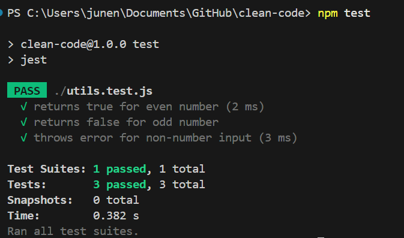

# Milestone: Clean code

## Understanding Clean Code Principles

### Goal

Understand the core principles of clean code and why they matter in real-world development.

## Tasks

- [x] Research and summarize the following clean code principles in clean_code.md:
  - Simplicity – Keep code as simple as possible.
  - Readability – Code should be easy to understand.
  - Maintainability – Future developers (including you!) should be able to work with the code easily.
  - Consistency – Follow style guides and project conventions.
  - Efficiency – Write performant, optimized code without premature over-engineering.
  
  **🧼 Clean Code Principles**
  Clean code is code that is easy to read, understand, and maintain. It minimizes cognitive load and helps developers write better software over time. Below are key principles of clean code, supported by well-known industry references.

  1. **Simplicity**
    Code should be as simple as possible—no more, no less. It should do what it needs to do and nothing more.

    Simple code is easier to test, debug, and refactor.

    *"The art of programming is the art of organizing complexity, of mastering multitude and avoiding its bastard chaos as effectively as possible."*
    — Edsger W. Dijkstra

    Best practice: Avoid cleverness or premature abstraction; prioritize clarity over ingenuity.

  2. **Readability**
    Code should be written for humans first, and machines second.

    Readable code reduces onboarding time and makes collaboration smoother.

    *"Code is read much more often than it is written."*
    — Robert C. Martin, Clean Code

    Best practice: Use descriptive naming, consistent formatting, and clear logic.

  3. **Maintainability**
    Code should be easy to change, extend, or refactor without breaking existing functionality.

    Most of the cost in software comes after the initial development. Maintainable code keeps long-term costs low.

    *"Clean code always looks like it was written by someone who cares."*
    — Robert C. Martin

    Best practice: Write modular code with minimal dependencies and clear boundaries.

  4. **COnsistency**
    Code should follow a uniform style across the entire project.

    Consistency allows developers to predict how code is structured, which speeds up understanding.

    *"A foolish consistency is the hobgoblin of little minds…"*
    — Ralph Waldo Emerson (often quoted in programming style guides)

    Best practice: Use linting tools, code formatters, and follow agreed-upon conventions (e.g., PEP 8 for Python).

  5. **Efficiency**
    Code should be performant and make good use of resources, but not at the cost of readability.

    Efficient code scales better and can reduce infrastructure costs.

    *"Premature optimization is the root of all evil."*
    — Donald Knuth

    Best practice: Write correct and clean code first, then profile and optimize only when needed.

  Related Sources:
  - Robert C. Martin, Clean Code: A Handbook of Agile Software Craftsmanship, 2008
  - [PEP 8 – Python Enhancement Proposal](https://peps.python.org/pep-0008/)

- [x] Find an example of messy code online (or write one yourself) and describe why it's difficult to read.

```js
function f(n){if(n==0){return 1;}else{return n*f(n-1);}}

// Example usage:
console.log(f(5)); // Should print 120
```

Issues:

- Lack of Descriptive Naming: The function name f doesn't convey its purpose.
- Poor Formatting: The entire function is written on a single line, making it hard to read.
- Inconsistent Spacing: There's no space around operators and after commas, which hampers readability.
- No Input Validation: The function doesn't handle negative inputs or non-integer values.

- [x] Rewrite the code in a cleaner, more structured way.

```js
/**
 * Calculates the factorial of a non-negative integer.
 * @param {number} number - A non-negative integer.
 * @returns {number} - The factorial of the input number.
 * @throws {Error} - If the input is not a non-negative integer.
 */
function calculateFactorial(number) {
  if (!Number.isInteger(number) || number < 0) {
    throw new Error('Input must be a non-negative integer.');
  }

  if (number === 0) {
    return 1;
  }

  return number * calculateFactorial(number - 1);
}

// Example usage:
console.log(calculateFactorial(5)); // Output: 120
```

Improvements:

- Descriptive Naming: Renamed the function to calculateFactorial to clearly indicate its purpose.
- Proper Formatting: Structured the code with appropriate indentation and spacing for better readability.
- Input Validation: Added checks to ensure the input is a non-negative integer, throwing an error otherwise.
- Documentation: Included a JSDoc comment to explain the function's purpose, parameters, return value, and potential errors.

- [x] Commit and push your changes to GitHub.

___________________________________________________________

## Code Formatting & Style Guides

### Goal

Understand the importance of code formatting and how to use tools like linters to enforce consistency.

## Tasks

- [x] Research the importance of consistent code style.
Consistent code style improves collaboration, readability, and maintainability. When everyone follows the same conventions, developers can:
  - Quickly understand each other's code
  - Avoid style-based merge conflicts in version control
  - Catch bugs early with static analysis tools
  - Focus on solving problems rather than debating formatting

Using automated tools like ESLint and Prettier ensures style consistency across a project, regardless of who’s writing the code.

- [x] Review the Airbnb javascript style guide.
The Airbnb JavaScript Style Guide is one of the most widely adopted JavaScript style guides. It provides opinionated rules and best practices. Some key takeaways include:
  - Use `const` and `let` instead of var
  - Prefer arrow functions (`const add = (a, b) => a + b`)
  - Always use semicolons
  - Use triple equals (`===`) for comparisons
  - Use single quotes for strings ('hello' instead of "hello")
  - Use object and array shorthand when possible
  - Avoid unnecessary nesting
  - Handle errors explicitly using `try/catch`

- [x] Install and configure ESLint and Prettier in your development environment.
  Step 1: Initialize the project with `npm init -y`

  STep 2: Install both tools and their recommended configs:

  ```bash
  npm install --save-dev eslint prettier eslint-config-prettier eslint-plugin-prettier
  ```

  `eslint`: Finds and reports on problems in your code.

  `prettier`: Formats your code.

  `eslint-config-prettier`: Turns off ESLint rules that conflict with Prettier.

  `eslint-plugin-prettier`: Runs Prettier as an ESLint rule.

  Step 3: Run the ESLint initialization wizard to configure ESLint:

  ```bash
  npx eslint --init
  ```

  The system will prompt some questions like:

  ```bash
  √ What do you want to lint? · javascript
  √ How would you like to use ESLint? · problems
  √ What type of modules does your project use? · esm
  √ Which framework does your project use? · none
  √ Does your project use TypeScript? · no / yes
  √ Where does your code run? · browser
  The config that you've selected requires the following dependencies:

  eslint, @eslint/js, globals, eslint-plugin-react
  √ Would you like to install them now? · No / Yes
  √ Which package manager do you want to use? · npm
  ☕️Installing...
  ```

  This creates a .eslintrc config file.
  
  If not, create a .eslintrc.json file manually:

  ```json
  {
    "extends": ["prettier"],
    "plugins": ["prettier"],
    "rules": {
      "prettier/prettier": "error"
    }
  }
  ```

  Step 4: Add a Prettier Config by creating a .prettierrc file

  ```json
  {
    "semi": true,
    "singleQuote": true,
    "tabWidth": 2,
    "printWidth": 80,
    "trailingComma": "es5"
  }
  ```

  Step 5: Add Scripts to package.json

  ```json
  "scripts": {
    "lint": "eslint .",
    "format": "prettier --write ."
  }
  ```

- [x] Run the formatter and linter on your codebase and fix any issues.
  - Run ESLint using `npm run lint`.
  - Fix errors manually or with: `npx eslint . --fix`
  - Run Prettier `npm run format`
  
  After running the following command, I investigated that some code files have changed their structure.
  From:

  ```js
  function f(n){if(n==0){return 1;}else{return n*f(n-1);}}

  // Example usage:
  console.log(f(5)); // Should print 120
  ```

  To:

  ```js
  function f(n) {
  if (n == 0) {
      return 1;
    } else {
      return n * f(n - 1);
    }
  }

  // Example usage:
  console.log(f(5)); // Should print 120
  ```

- [x] Write reflections in clean_code.md:
  - Why is code formatting important?
    Consistent code formatting makes a codebase easier to read, navigate, and maintain. It reduces misunderstandings, minimizes merge conflicts in teams, and promotes shared ownership of the code. Well-formatted code is also easier to debug and refactor because structure and logic are visually clear.

    *"Style is not a matter of taste. It's a matter of making your code easier to read, understand, and change."*
    — Airbnb JavaScript Style Guide

  - What issues did the linter detect?
    While using ESLint, the linter detected several common code issues:
    - Missing semicolons: Some statements weren’t properly terminated.
    - Inconsistent spacing: There were extra or missing spaces around operators and keywords.
    - Unused variables: Some variables were declared but never used.
    - No newline at end of file: ESLint flagged missing final newlines as a style issue.
    - Incorrect indentation: Blocks of code were not indented consistently.

    These errors don’t necessarily break the code, but they make it harder to read, maintain, or debug.

  - Did formatting the code make it easier to read?
    Yes. Running Prettier and fixing linting issues dramatically improved readability. The code now has:
    - Clear, consistent spacing
    - Logical line breaks
    - Uniform indentation
    - Better organization overall

    It’s easier to scan visually, especially when switching between files or returning to the project after a break. The formatter also helped ensure that all team members would produce code that "looks the same."

- [x] Commit and push your changes to GitHub.

___________________________________________________________

## Naming Variables & Functions

### Goal

Learn how to choose clear and meaningful names for variables and functions.

## Tasks

- [x] Research best practices for naming variables and functions.
  - Use descriptive, specific names that communicate purpose (e.g., userAge instead of x)
  - Prefer nouns for variables, verbs for functions (e.g., calculateTotal(), fetchUserData())
  - Avoid abbreviations or cryptic names (cnt, tmp, val, etc.)
  - Use camelCase for variables and functions in JavaScript (isLoggedIn)
  - Name booleans with clear intent, like isAvailable, hasPermission, or shouldRetry
  - Be consistent — follow team or project naming conventions

  “You should name a variable using the same care with which you name a first-born child.”
  — Robert C. Martin (Clean Code)

- [x] Find examples of unclear variable names in an existing codebase (or write your own).
  Before Refactoring – Unclear Code Example

  ```js
  function c(d) {
    let t = 0;
    for (let i = 0; i < d.length; i++) {
      t += d[i];
    }
    return t;
  }

  let a = [1, 2, 3, 4];
  console.log(c(a));
  ```

  Problems:
  - `c` is not meaningful as a function name.
  - `d`, `t`, `a`, and `i` are too vague.
  - No indication of what the function actually does

- [x] Refactor the code by renaming variables/functions for better clarity.

  ```js
  function calculateSum(numbers) {
    let total = 0;
    for (let index = 0; index < numbers.length; index++) {
      total += numbers[index];
    }
    return total;
  }

  let values = [1, 2, 3, 4];
  console.log(calculateSum(values)); // Output: 10
  ```

  Improvements:
  - `calculateSum` clearly describes the function's purpose.
  - `numbers`, `total`, `index`, and `values` are meaningful and self-explanatory.

- [x] Write reflections in clean_code.md:
  - What makes a good variable or function name?
    - It clearly describes the purpose or data being represented
    - It avoids ambiguity and doesn’t rely on the reader’s guesswork
    - It’s consistent with the language and project conventions

  - What issues can arise from poorly named variables?
    - Confusion and misunderstandings during debugging or handoff
    - Wasted time trying to decipher what a variable is used for
    - Higher chance of introducing bugs due to unclear logic

  - How did refactoring improve code readability?
    Renaming variables and functions made the logic self-documenting. I no longer need to read line-by-line to understand what the function does — the names tell the story. This helps both in solo work and in team collaboration, especially on large codebases.

- [x] Commit and push your changes to GitHub.

___________________________________________________________

## Avoiding Code Duplication

### Goal

Understand how to identify and eliminate unnecessary duplication in code.

## Tasks

- [x] Research the "Don't Repeat Yourself" (DRY) principle.
  The **DRY** principle encourages developers to eliminate redundancy by *abstracting repeated logic* into reusable components (functions, classes, modules, etc.).

  "Every piece of knowledge must have a single, unambiguous, authoritative representation within a system."
  — Andy Hunt & Dave Thomas, The Pragmatic Programmer

  Violating DRY leads to more error-prone, bloated code that's harder to update and test.

- [x] Find a section of code in your test repo with unnecessary repetition.
  Each function duplicates the string concatenation pattern — the only thing that changes is the greeting word.

  ```js
  function greetUserEnglish(name) {
    return 'Hello, ' + name + '!';
  }

  function greetUserSpanish(name) {
    return 'Hola, ' + name + '!';
  }

  function greetUserFrench(name) {
    return 'Bonjour, ' + name + '!';
  }
  ```

- [x] Refactor the code to eliminate duplication.
  Now the logic is centralized in one place. To support a new language, I simply add a key to the greetings object — no new function needed.

  ```js
  function greetUser(name, language = 'en') {
    const greetings = {
      en: 'Hello',
      es: 'Hola',
      fr: 'Bonjour',
    };

    const greeting = greetings[language] || greetings.en;
    return `${greeting}, ${name}!`;
  }
  ```

- [x] Write reflections in clean_code.md:
  - What were the issues with duplicated code?
    - Code was harder to maintain — adding a new greeting required creating a whole new function.
    - Repetition increases the chance of inconsistent logic or bugs if one copy is changed and others are not.
    - It bloated the file with unnecessary lines.

  - How did refactoring improve maintainability?
    - The logic became modular and flexible — one place to manage greetings for any language.
    - It made future changes easier (e.g., adding German would take just one line).
    - The code became easier to test, read, and extend — a clear win for long-term scalability.

- [x] Commit and push your changes to GitHub.

___________________________________________________________

## Writing Small, Focused Functions

### Goal

Learn how to break down large functions into smaller, more maintainable units.

## Tasks

- [x] Research best practices for writing small, single-purpose functions.
  - A function should do one thing and do it well.
  - Prefer descriptive names over comments.
  - Limit functions to 5–15 lines when possible.
  - Functions should have minimal side effects and clearly defined inputs/outputs
  - If a function contains multiple levels of abstraction, it should probably be split.
  
  "Functions should do something, or answer something, but not both."
  — Robert C. Martin, Clean Code

- [x] Find an example of a long, complex function in an existing codebase (or write your own).

  ```js
  function processOrder(order) {
    let total = 0;
    for (let i = 0; i < order.items.length; i++) {
      let item = order.items[i];
      let itemTotal = item.price * item.quantity;
      total += itemTotal;

      console.log(
        `Item: ${item.name}, Quantity: ${item.quantity}, Total: $${itemTotal}`
      );

      if (item.quantity > item.stock) {
        console.log(`Warning: Not enough stock for ${item.name}`);
      }
    }

    if (order.coupon) {
      if (order.coupon.type === 'percentage') {
        total = total - total * (order.coupon.value / 100);
      } else if (order.coupon.type === 'fixed') {
        total = total - order.coupon.value;
      }
    }

    console.log(`Final Total: $${total}`);
  }
  ```

- [x] Refactor it into multiple smaller functions with clear responsibilities.

  ```js
  function calculateItemTotal(item) {
    return item.price * item.quantity;
  }

  function logItemDetails(item, itemTotal) {
    console.log(`Item: ${item.name}, Quantity: ${item.quantity}, Total: $${itemTotal}`);
    if (item.quantity > item.stock) {
      console.log(`Warning: Not enough stock for ${item.name}`);
    }
  }

  function applyCoupon(total, coupon) {
    if (!coupon) return total;
    if (coupon.type === 'percentage') {
      return total - total * (coupon.value / 100);
    }
    if (coupon.type === 'fixed') {
      return total - coupon.value;
    }
    return total;
  }

  function processOrder(order) {
    let total = 0;
    order.items.forEach(item => {
      const itemTotal = calculateItemTotal(item);
      logItemDetails(item, itemTotal);
      total += itemTotal;
    });

    total = applyCoupon(total, order.coupon);
    console.log(`Final Total: $${total}`);
  }
  ```

- [x] Write reflections in clean_code.md:
  - Why is breaking down functions beneficial?
    - Each function becomes easier to understand and test.
    - Clear separation of concerns — every part of the logic is handled in one specific place.
    - Smaller functions can be reused elsewhere in the codebase.

  - How did refactoring improve the structure of the code?
    - The logic became more readable and well-organized.
    - Instead of one long flow, my code now have clear, descriptive function names that document what’s happening.
    - Easier to maintain: if coupon logic changes, it only update `applyCoupon()`.

- [x] Commit and push your changes to GitHub.

___________________________________________________________

## Refactoring Code for Simplicity

### Goal

Learn how to simplify complex or overly engineered code without losing functionality.

## Tasks

- [x] Research common refactoring techniques.
  - Extract functions to break down complex logic.
  - Replace conditionals with polymorphism (in OOP scenarios).
  - Use guard clauses to reduce nesting.

    **Guard clauses** allow early exits from a function when input is invalid or doesn’t meet requirements. This avoids unnecessary nesting and makes code easier to read.

    ```js
    function getUserName(user) {
      if (!user) return 'Guest';
      return user.name;
    }
    ```

  - Inline temporary variables when not needed.
  - Eliminate redundant code paths.
  - Replace loops with array methods like map, filter, reduce.
  - Apply meaningful naming to improve self-documentation.

- [x] Find an example of overly complicated code in an existing project (or write your own).

  ```js
  function checkIfUserCanAccessPage(user, page) {
    if (user && user.role) {
      if (page && page.requiredRole) {
        if (user.role === page.requiredRole) {
          return true;
        } else {
          return false;
        }
      } else {
        return false;
      }
    } else {
      return false;
    }
  }
  ```

  Problems:
  - Deep nesting makes the code hard to follow.
  - Repetitive else branches for every condition.
  - Overly verbose logic for a simple permission check.

- [x] Refactor it to make it simpler and more readable.

  ```js
  function checkIfUserCanAccessPage(user, page) {
    if (!user?.role || !page?.requiredRole) return false;
    return user.role === page.requiredRole;
  }
  ```

  Improvements:
  - Uses guard clauses to exit early.
  - Reduces lines of code without losing clarity.
  - Uses optional chaining (?.) for concise null checks.
  - Makes the core logic more visible: "Does the user's role match the page's required role?"

- [x] Write reflections in clean_code.md:
  - What made the original code complex?
    - Too many nested conditionals and repeated else statements.
    - Logic was buried inside multiple if blocks, requiring more mental effort to follow.
    - No clear separation between validation and main logic.

  - How did refactoring improve it?
    - Reduced cognitive load — logic is now readable in one glance.
    - Easier to maintain, test, and debug.
    - Cleaner syntax using modern JavaScript features like optional chaining.

- [x] Commit and push your changes to GitHub.

___________________________________________________________

## Handling Errors & Edge Cases

### Goal

Learn how to write robust code that gracefully handles errors and unexpected inputs.

## Tasks

- [x] Research strategies for handling errors and edge cases in code (include Guard Clauses).
  - Use guard clauses to handle invalid inputs early.
  - Validate function arguments and assumptions.
  - Prefer `try...catch` blocks for potentially unsafe operations (e.g., file access, API calls).
  - Use descriptive error messages to aid debugging.
  - Always fail loudly and early — silent failures are hard to detect.
  - Return consistent error responses (especially in APIs).

- [x] Find an existing function that doesn’t properly handle errors or invalid inputs.

  ```js
  function divide(a, b) {
    return a / b;
  }
  ```

  Issues:
  - No check for division by zero
  - No type validation (e.g., divide('5', null) would return NaN)
  - No user feedback for invalid input

- [x] Refactor the function to improve error handling.

  ```js
  function divide(a, b) {
    if (typeof a !== 'number' || typeof b !== 'number') {
      throw new TypeError('Both arguments must be numbers.');
    }

    if (b === 0) {
      throw new Error('Division by zero is not allowed.');
    }

    return a / b;
  }
  ```

  Or wrapped in a safe caller with `try/catch`:

  ```js
  try {
    console.log(divide(10, 0));
  } catch (error) {
    console.error('Error:', error.message);
  }
  ```

- [x] Write reflections in clean_code.md:
  - What was the issue with the original code?
    - It assumed valid inputs and allowed invalid operations like dividing by zero or using non-numeric types.
    - The function could return unexpected or misleading results (NaN, Infinity, etc.) without any explanation.
  
  - How does handling errors improve reliability?
    - Prevents an application from crashing or returning incorrect results.
    - Helps developers identify bugs early with meaningful feedback.
    - Increases user trust by clearly communicating when something goes wrong.

- [x] Commit and push your changes to GitHub.

___________________________________________________________

## Commenting & Documentation

### Goal

Learn when and how to write helpful comments and documentation.

## Tasks

- [x] Research best practices for writing comments and documentation.
  - Write comments only when necessary -> they should explain “why,” not “what”.
  - Use doc comments (e.g., JSDoc, Python docstrings) to describe function purpose, parameters, and return values
  - Keep comments concise and up-to-date
  - Avoid commenting bad code -> refactor instead!
  - Don’t restate what the code already makes obvious

- [x] Find an example of poorly commented code and rewrite the comments to be more useful.

  ```js
  // add
  function a(x, y) {
    return x + y; // returns the sum
  }
  ```

  Issues:
  - Function name and comment are too vague.
  - Comment adds no value (just repeats the code).
  - No context about how or when it should be used.
  
  Improved Version is shown below, by giving a clear, descriptive function and parameter names. Doc comment provides useful info about purpose and usage. Anyone reading this can understand and use it without guessing

  ```js
  /**
  * Adds two numbers together.
  *
  * @param {number} num1 - The first number to add.
  * @param {number} num2 - The second number to add.
  * @returns {number} The sum of num1 and num2.
  */
  function addNumbers(num1, num2) {
    return num1 + num2;
  }
  ```

- [x] Write reflections in clean_code.md:
  - When should you add comments?
    - When the reason behind a decision isn't obvious from the code.
    - When working with complex logic, edge cases, or performance hacks.
    - When I need to clarify intent that might not be self-evident.
    - In public APIs or shared libraries to document usage for others.

  - When should you avoid comments and instead improve the code?
    - When a better function name or refactoring can make the code self-explanatory.
    - When comments are just repeating the code.

- [x] Commit and push your changes to GitHub.

___________________________________________________________

## Writing Unit Tests for Clean Code

### Goal

Learn how writing unit tests helps maintain clean and reliable code.

## Tasks

- [x] Research the importance of unit testing in software development.
  **Unit testing** involves testing individual functions or components in isolation to ensure they behave as expected. It's a foundational part of Test-Driven Development (TDD) and continuous integration pipelines.

  Benefits of unit testing:
  - Helps catch bugs early.
  - Encourages writing modular, testable functions.
  - Serves as live documentation of your code’s behavior
  - Builds confidence to refactor or update code

- [x] Choose a testing framework (e.g., Jest for JavaScript, PyTest for Python).
  In onboarding milestone, Jest is provided to learn, which is a popular JavaScript testing framework by Facebook. It requires no configuration for basic use and has built-in matchers, mocking, and coverage tools.

- [x] Write a few unit tests for a function in your test repo.
  Function to Test (utils.js):

  ```js
  function isEven(number) {
    if (typeof number !== 'number') {
      throw new Error('Input must be a number');
    }
    return number % 2 === 0;
  }

  module.exports = isEven;
  ```

  Test File (utils.test.js):

  ```js
  const isEven = require('./utils');

  test('returns true for even number', () => {
    expect(isEven(4)).toBe(true);
  });

  test('returns false for odd number', () => {
    expect(isEven(5)).toBe(false);
  });

  test('throws error for non-number input', () => {
    expect(() => isEven('hello')).toThrow('Input must be a number');
  });
  ```

  Run the tests: `npm test`



- [x] Write reflections in clean_code.md:
  - How do unit tests help keep code clean?
    - They force me to write small, pure functions that are easy to test.
    - I am less likely to introduce bugs when refactoring — tests will catch regressions.
    - They clarify the expected behavior of my functions for future developers.

  - What issues did you find while testing?
    - Initially, the function did not check input type, which could return incorrect or misleading results (isEven("4") would have returned false).
    - Writing tests exposed the need for input validation, improving code quality overall.
    - It also helped define clearer boundaries for what the function should and shouldn’t do.

- [x] Commit and push your changes to GitHub.

___________________________________________________________

## Identifying & Fixing Code Smells

### Goal

Learn how to recognize common code smells and refactor them for better readability, maintainability, and performance.

## Tasks

- [x] Research common code smells and how they impact code quality.
  Code smells are patterns in code that signal deeper issues. They aren’t bugs, but they make code harder to understand, maintain, or extend. Recognizing and fixing them leads to cleaner, more reliable software.

  Source:[Code Smell](https://www.geeksforgeeks.org/code-smell-a-general-introduction-and-its-type/)

- [x] Find or write code examples that demonstrate the following code smells and
- [x] Refactor the code to eliminate these code smells.
  - Magic Numbers & Strings – Using hardcoded values instead of constants.
    Before:

    ```js
    let price = 120;
    let tax = price * 0.07;
    ```

    After improving clarity and allows easy changes in one place.

    ```js
    const TAX_RATE = 0.07;
    let tax = price * TAX_RATE;
    ```

  - Long Functions – Functions that do too much and should be broken into smaller parts.
    Before:

    ```js
    function processOrder(order) {
      // calculate total
      // log item info
      // apply discount
      // send confirmation email
    }
    ```

    After separate into each subtask, which is clearer and independently testable.

    ```js
    function processOrder(order) {
      const total = calculateTotal(order);
      logOrderDetails(order);
      const finalTotal = applyDiscount(order, total);
      sendConfirmationEmail(order);
    }
    ```

  - Duplicate Code – Copy-pasting logic instead of reusing functions.
    Before:

    ```js
    if (user.role === 'admin') { showAdminPanel(); }
    if (user.role === 'admin') { logAccess(); }
    ```

    After following DRY principle.

    ```js
    if (user.role === 'admin') {
      showAdminPanel();
      logAccess();
    }
    ```

  - Large Classes (God Objects) – Classes that handle too many responsibilities.
    Before:

    ```js
    class UserManager {
      // authentication
      // profile handling
      // billing
      // email notifications
    }
    ```

    After breaking single responsibility into manageable modules.

    ```js
    class AuthService {}
    class ProfileService {}
    class BillingService {}
    class NotificationService {}
    ```

  - Deeply Nested Conditionals – Complex if/else trees that make code harder to follow.
    Before:

    ```js
    if (user) {
      if (user.loggedIn) {
        if (user.hasPermission) {
          // do task
        }
      }
    }
    ```

    After improving readability using guard clauses.

    ```js
    if (!user || !user.loggedIn || !user.hasPermission) return;
    // do task
    ```

  - Commented-Out Code – Unused code that clutters the codebase.
    Before:

    ```js
    // function oldLogin() {
    //   return false;
    // }
    ```

    After removing unused code.

    ```js
    // Removed oldLogin: replaced by new secureAuth method.
    ```

  - Inconsistent Naming – Variable names that don't clearly describe their purpose.
    Before:

    ```js
    let x = 5;
    let tmp = x * 2;
    ```

    After adding meaningful names help future readers understand logic without guessing.

    ```js
    let itemCount = 5;
    let totalCost = itemCount * 2;
    ```

- [x] Write reflections in code_smells.md:
  - What code smells did you find in your code?
    - Magic numbers for tax rates and limits.
    - Large functions handling multiple concerns.
    - Repeated logic for role checks.
    - Old code commented out instead of deleted.
    - Variable names like `x`, `tmp`, and `foo`.

  - How did refactoring improve the readability and maintainability of the code?
    - Simplified control flow and reduced nesting.
    - Smaller, clearer functions with single responsibilities.
    - Centralized constants and removed duplication.
    - Improved naming helps explain intent without needing extra comments.

  - How can avoiding code smells make future debugging easier?
    - Easier to pinpoint issues in smaller, focused functions.
    - Avoids reintroducing bugs when changing duplicated logic.
    - Clear names and modular code reduce time needed to understand unfamiliar code.

- [x] Commit and push your changes to GitHub.

___________________________________________________________

## Static Analysis Checks in CI/CD

### Goal

Understand the purpose of Continuous Integration (CI) and Continuous Deployment (CD) and learn how to enforce Markdown linting and spell checks automatically in a project.

## Tasks

- [x] Research what CI/CD is and why it’s used in software development.
  **Continuous Integration (CI)** is the practice of automatically testing and validating code every time a change is pushed to the repository.

  **Continuous Deployment (CD)** takes this a step further by automatically releasing tested code to production.

  *“CI/CD ensures that code is always in a deployable state.”*

  Benefits of CI/CD:
  - Catches bugs and style issues early
  - Reduces human error in deployments
  - Encourages small, frequent commits
  - Saves time with automated workflows

- [x] Set up a CI workflow that runs Markdown linting and spell checks on PRs in your repo.
  1. Initialize the project using:

    ```bash
    npm init -y
    ```

  2. Install tools locally

    ```bash
    npm install --save-dev markdownlint-cli2 cspell
    ```

  3. Add npm scripts to `package.json`

    ```json
    "scripts": {
      "lint:md": "markdownlint-cli2 '**/*.md' '#node_modules'",
      "lint:md:fix": "markdownlint-cli2-fix '**/*.md' '#node_modules'",
      "spellcheck": "cspell '**/*' --config cspell.json"
    }
    ```

  4. Create a config file for spell checking `cspell.json`

    ```json
    {
      "version": "0.2",
      "language": "en",
      "files": ["**/*.md"],
      "ignorePaths": ["node_modules"],
      "words": ["markdownlint", "cspell", "Husky", "CI", "PR"]
    }
    ```
  
  5. Created a custom `.markdownlint.jsonc` configuration to:
  - Allow long lines (up to 800 characters)
  - Disable or relax strict rules (like MD024 for duplicate headings and MD029 for ordered list prefixes)
  
    ```json
    {
      "default": true,

      // Allow long lines
      "MD013": {
        "line_length": 800,
        "ignore_code_blocks": true,
        "tables": false
      },

      // Disable MD029 (ordered list prefix)
      "MD029": false,

      // Disable MD024 (duplicate headings)
      "MD024": false,

      // Other rules you already disabled
      "MD033": false,
      "MD036": false,
      "MD040": false,
      "MD001": false,
      "MD035": false
    }
    ```

- [x] Experiment with Git Hooks (e.g., Husky) to enforce linting before commits.
  Install Husky to manage Git hooks:

  ```bash
  npx husky install
  npm husky init
  ```

  After initialize Husky, then edit `.husky/pre-commit` that automatically:
  - Runs `markdownlint-cli2` to check Markdown formatting.
  - Runs `cspell` to detect spelling issues in Markdown files.

  ```sh
  #!/usr/bin/env sh
  . "$(dirname -- "$0")/_/husky.sh"

  # Lint and auto-fix Markdown files
  npx markdownlint-cli2 "**/*.md" "#node_modules"

  # Spellcheck
  npx cspell "**/*.md"
  ```

  Now every time I try to commit, it will run both linters.

- [x] Open a test PR in your repository and review the automated checks.
  Create the file `.github/workflows/markdown-checks.yml`, then paste the following content inside:

  ```yaml
  name: Lint Markdown and Spellcheck

  on:
    pull_request:
      branches: [main]

  jobs:
    lint:
      runs-on: ubuntu-latest
      steps:
        - uses: actions/checkout@v3

        - name: Install markdownlint and cspell
          run: |
            npm install -g markdownlint-cli cspell

        - name: Run markdownlint
          run: markdownlint "**/*.md"

        - name: Run spell check
          run: cspell --config cspell.json
  ```

- [x] Push your CI/CD configuration to your repo.

- [x] Write reflections in ci_cd_reflection.md:
  - What is the purpose of CI/CD?
    CI/CD automates the process of building, testing, and deploying software. It reduces the risk of bugs reaching production and ensures consistency in team workflows. For solo projects, it ensures I don’t miss important quality checks; for teams, it keeps everyone aligned.

  - How does automating style checks improve project quality?
    - Enforces a consistent standard across the entire codebase.
    - Eliminates manual formatting and typo checks.
    - Allows contributors to focus on logic rather than nitpicks.
    - Creates more readable and professional documentation.

  - What are some challenges with enforcing checks in CI/CD?
    - Setup can be tricky for beginners or custom workflows.
    - May need to tweak tools (like cspell) to ignore project-specific jargon.
    - Slower pipelines can frustrate contributors.
    - Requires buy-in from all contributors to be effective

  - How do CI/CD pipelines differ between small projects and large teams?
| Feature         | Small Project                          | Large Team                                           |
|----------------|-----------------------------------------|------------------------------------------------------|
| Setup Effort    | Minimal                                 | Requires planning and team coordination              |
| Speed           | Fast, simple pipelines                  | May need caching, parallelism, and scaling           |
| Scope           | Linting, basic tests                    | Includes tests, deployments, security scans          |
| Flexibility     | High – you can experiment easily        | Lower – changes require consensus and testing        |
