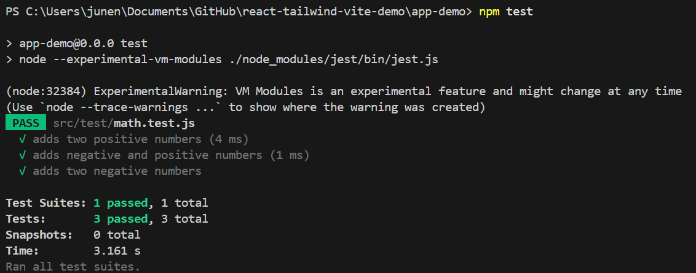

# Milestone: Jest for unit tests

## Introduction to Unit Testing with Jest

### Goal

Learn the basics of unit testing in React using Jest.

### Why is this important?

Focus Bear relies on automated testing to ensure the stability of features across updates. Writing unit tests prevents regressions and improves code reliability.

## Tasks

- [x] Research what Jest is and why unit tests are important.
  Jest is a JavaScript testing framework built by Meta, often used with React. It lets you write tests to:
  - Verify your code works correctly.
  - Catch bugs before they reach users.
  - Make changes without breaking existing functionality (regression testing).

  Source: [Testing with Jest](https://www.geeksforgeeks.org/testing-with-jest/)

  My project use Vite. **Vite** is designed for native ESM and uses its own plugin system for fast frontend tooling (like dev server, hot reload, etc).
  
  Jest is not officially supported by Vite, because:
  - Jest uses its own bundler and mocking system.
  - Vite’s plugin architecture doesn’t integrate cleanly with Jest.

- [x] Set up Jest in your React project (if not already included).
  **Step 1: Install Required Packages**

  ```bash
    npm install --save-dev jest babel-jest @babel/preset-env @babel/preset-react jest-environment-jsdom
  ```

  **Step 2: Create babel.config.mjs**
  This lets Jest understand modern React code.

  ```mjs
  // babel.config.js
  export default {
    presets: ['@babel/preset-env', '@babel/preset-react'],
  };
  ```

  **Step 3: Created a Jest config for ESM**

  ```mjs
  // jest.config.mjs
  export default {
    transform: {
      '^.+\\.[jt]sx?$': ['babel-jest', {
        presets: ['@babel/preset-env', '@babel/preset-react']
      }],
    },
    extensionsToTreatAsEsm: ['.jsx'], // ✅ removed '.js' to avoid warning
    testEnvironment: 'jsdom',
  };
  ```

  **Step 4: Updated your test script in `package.json`**
  This avoids the shell script error on Windows and enables ESM support.

  ```json
  "scripts": {
  "test": "node --experimental-vm-modules ./node_modules/jest/bin/jest.js"
  }
  ```

- [x] Write a simple test for a utility function (e.g., a function that adds two numbers).

  ```js
  // math.js
  export function add(a, b) {
    return a + b;
  }
  ```

  Test file:

  ```js
  // math.test.js
  import { add } from '../app/math';

  test('adds two positive numbers', () => {
    expect(add(2, 3)).toBe(5);
  });

  test('adds negative and positive numbers', () => {
    expect(add(-1, 4)).toBe(3);
  });

  test('adds two negative numbers', () => {
    expect(add(-3, -2)).toBe(-5);
  });
  ```

- [x] Run the test and check that it passes.


- [x] Push your test to GitHub.
- [x] Reflection (in unit_tests.md):
  - Why is automated testing important in software development?
  Automated testing is really important to me as a developer because it brings a lot of value to the development process:
  - It helps prevent regressions
    When I make changes to my code, automated tests catch bugs that might break existing features — which saves me from introducing new issues.
  - It boosts my confidence
    Knowing I have tests in place gives me peace of mind when refactoring or adding new features, because I know I’ll be alerted if something breaks.
  - It saves a ton of time
    Instead of manually checking every detail, my tests run in seconds and catch things I might miss by hand.
  - It helps me write better code
    Writing tests forces me to think more clearly about the structure and logic of my code, which usually leads to cleaner, more modular solutions.
  - It makes collaboration easier
    When working with a team, automated tests make it clear how the code is supposed to behave, and they help prevent accidental breakage when others make changes.

  - What did you find challenging when writing your first Jest test?
    Writing my first Jest test was definitely a bit tricky because of a few things:
    1. Unfamiliar syntax
       - Functions like describe(), test(), and expect() were completely new to me, especially since I wasn’t used to test-driven development.
    2. Setting up the environment
       - Working with modern stacks like Vite, ESM, and React made things more confusing — getting Babel configured properly, setting up jsdom, and handling module transforms took some trial and error.
    3. Mocking complexity
       - I found mocking things like APIs (fetch, axios) or child components to be harder than expected. It took some practice to understand how and when to mock correctly.
    4. Mental shift
       - The biggest challenge was probably the mindset change — instead of building features, I had to think about how those features might break and write tests to catch those failures in advance.

___________________________________________________________

## Testing Redux with Jest

### Goal

Learn how to test Redux slices and actions using Jest.

### Why is this important?

State management is central to Focus Bear’s functionality. Writing tests for Redux ensures that reducers and actions work as expected.

## Tasks

- [x] Research how to test Redux reducers and actions in Jest.

Testing Redux logic is essential to ensure your state management works correctly. In **Redux Toolkit**, reducers and actions (including async thunks) can be tested independently using **Jest**. Below is a full guide with explanations and examples.

  1. Testing Redux Reducers with Jest
  
    A reducer is a pure function that takes the current state and an action, and returns the next state. Since it’s pure and deterministic, it’s easy to test.

    Reducers are the core of state logic. You want to make sure:
     - The initial state is correct.
     - Actions update state as expected.
     - State remains predictable and consistent.

    Testing a reducer by:
    1. Calling the reducer directly.
    2. Passing in a known state and action.
    3. Asserting the returned state.

    Example:

    ```js
    import reducer, { increment, decrement } from './counterSlice';

    describe('counter reducer', () => {
      it('should return the initial state', () => {
        expect(reducer(undefined, { type: '' })).toEqual({ value: 0, status: 'idle' });
      });

      it('should handle increment', () => {
        const initialState = { value: 0, status: 'idle' };
        expect(reducer(initialState, increment()).value).toBe(1);
      });

      it('should handle decrement', () => {
        const initialState = { value: 1, status: 'idle' };
        expect(reducer(initialState, decrement()).value).toBe(0);
      });
    });
    ```

  2. Testing Redux Actions
    An action is a plain object describing **what happened**. It must have a `type` property and can optionally include a `payload`.

    In Redux Toolkit, action creators are automatically generated from `createSlice`, so testing them is often not necessary.

    While most Redux Toolkit apps don’t need to test action creators directly, you can test them to:
     - Confirm they return the expected action object.
     - Validate types and payloads.

    Example:

    ```js
    import { increment } from './counterSlice';

    describe('counter actions', () => {
      it('should create an increment action', () => {
        expect(increment()).toEqual({ type: 'counter/increment' });
      });
    });
    ```
  
  3. Testing Asynchronous Redux Actions (createAsyncThunk)
    `createAsyncThunk` is a helper from Redux Toolkit to manage async logic like API calls. It handles:
     - Dispatching a `pending` action when the async call starts
     - Dispatching a `fulfilled` action when the call resolves
     - Dispatching a `rejected` action when the call fails

    Why Test Async Actions?:
     - Ensure that thunks trigger the correct lifecycle actions
     - Validate state changes (e.g. `loading → success → result`)
     - Simulate API behavior without needing real network calls

    Example Test for `incrementAsync`

    Assume we have this thunk in our slice:

    ```js
    // counterSlice.js
    export const incrementAsync = createAsyncThunk(
      'counter/incrementAsync',
      async (amount) => {
        return new Promise((resolve) =>
          setTimeout(() => resolve(amount), 500)
        );
      }
    );
    ```

    Here’s a test for that:

    ```js
    import { configureStore } from '@reduxjs/toolkit';
    import counterReducer, { incrementAsync } from './counterSlice';

    describe('incrementAsync thunk', () => {
      it('should update state after fulfilled async action', async () => {
        const store = configureStore({ reducer: { counter: counterReducer } });

        expect(store.getState().counter.value).toBe(0);

        await store.dispatch(incrementAsync(5));

        const state = store.getState().counter;
        expect(state.value).toBe(5);
        expect(state.status).toBe('idle');
      });
    });
    ```

| Test Type        | Purpose                                      | How to Do It |
|------------------|----------------------------------------------|--------------|
| **Reducer Test** | Validate state updates for specific actions  | Call reducer with action + initial state |
| **Action Test**  | (Optional) Check correct action object       | Call action creator and compare `.type`, `.payload` |
| **Async Thunk**  | Test async logic and side-effects            | Dispatch thunk in store, use `await`, inspect final state |

  Tips

  - Always test reducers directly for logic.
  - Component tests (like using `@testing-library/react`) test UI, not Redux logic.
  - Use `configureStore()` from Redux Toolkit in tests for realistic store setup.
  - Mock API calls in async tests if needed for reliability and speed.

  Additional Resources
  - [Redux Toolkit Documentation](https://redux-toolkit.js.org/)
  - [Redux Official Style Guide](https://redux.js.org/style-guide/style-guide)
  - [Testing Library Docs](https://testing-library.com/docs/)
  - [Jest Documentation](https://jestjs.io/docs/getting-started)


- [x] Create a simple Redux slice (if not already created).

I simply use a `counterSlice.js` from previous Redux learning. A Redux slice contains:
  - State (initialState)
  - Reducers (functions that update state)
  - Actions (auto-generated from reducers)

```js
import { createSlice, createAsyncThunk } from '@reduxjs/toolkit';

// Async thunk — simulates a delayed increment
export const incrementAsync = createAsyncThunk(
  'counter/incrementAsync',
  async (amount) => {
    return new Promise((resolve) => {
      setTimeout(() => resolve(amount), 500);
    });
  }
);

const initialState = {
  value: 0,
  status: 'idle',
};

const counterSlice = createSlice({
  name: 'counter',
  initialState,
  reducers: {
    increment: (state) => {
      state.value += 1;
    },
    decrement: (state) => {
      state.value -= 1;
    },
  },
  extraReducers: (builder) => {
    builder
      .addCase(incrementAsync.pending, (state) => {
        state.status = 'loading';
      })
      .addCase(incrementAsync.fulfilled, (state, action) => {
        state.value += action.payload;
        state.status = 'idle';
      });
  },
});

export const { increment, decrement } = counterSlice.actions;
export const selectCounterValue = (state) => state.counter.value;
export default counterSlice.reducer;
```

- [x] Write a test that checks if a reducer updates state correctly.

```jsx
// counterSlice.test.js
import reducer, { increment, decrement } from '../features/counter/counterSlice';

describe('counter reducer', () => {
  it('should return the initial state', () => {
    expect(reducer(undefined, { type: '' })).toEqual({ value: 0, status: 'idle' });
  });

  it('should handle increment', () => {
    const nextState = reducer({ value: 0 }, increment());
    expect(nextState.value).toBe(1);
  });

  it('should handle decrement', () => {
    const nextState = reducer({ value: 1 }, decrement());
    expect(nextState.value).toBe(0);
  });
});
```

- [x] Write a test for an asynchronous Redux action (if applicable).

```jsx
// counterAsync.test.jsx
import { configureStore } from '@reduxjs/toolkit';
import counterReducer, { incrementAsync } from '../features/counter/counterSlice';

describe('incrementAsync thunk', () => {
  it('should dispatch pending and fulfilled, updating state', async () => {
    const store = configureStore({ reducer: { counter: counterReducer } });

    // Before dispatch
    expect(store.getState().counter).toEqual({ value: 0, status: 'idle' });

    // Dispatch async thunk
    const result = await store.dispatch(incrementAsync(3));

    // Result should be fulfilled
    expect(result.type).toBe('counter/incrementAsync/fulfilled');

    // After dispatch
    const state = store.getState().counter;
    expect(state.value).toBe(3);
    expect(state.status).toBe('idle');
  });
});
```

- [x] Run the tests and check that they pass.
- [x] Push your test to GitHub.

- [x] Reflection (in unit_tests.md):
  - What was the most challenging part of testing Redux?
    
    The most challenging part for me was understanding how to test asynchronous actions using `createAsyncThunk`. At first, I assumed that testing a Redux-connected component that updates state would count as testing async logic — but I realized those interactions were synchronous.
    
    Once I introduced `incrementAsync` and added new state like status, I had to be more careful about what the reducer returns, and make sure the tests reflect that. It also took a bit of trial and error to simulate the pending and fulfilled states correctly in tests without actually waiting for real-time delays.
    
    Overall, the tricky part was switching my mindset from "just click and see" to "simulate dispatching actions and inspect the state step-by-step."

  - How do Redux tests differ from React component tests?

    Redux tests are focused purely on logic and state — they don't involve the UI at all. I'm just dispatching actions and checking how the state changes. It feels more like testing a function with inputs and expected outputs.

    React component tests, on the other hand, are all about rendering the UI and simulating user interactions. They use tools like @testing-library/react to verify whether things appear on the screen, and they're more visual in nature.

    Redux tests are generally faster and simpler once the setup is done, and they’re great for validating the "brain" of the app. React tests test the "face" — what the user sees and does.
___________________________________________________________

## Mocking API Calls in Jest
### Goal
Learn how to mock API calls in Jest to test asynchronous code.

### Why is this important?
Focus Bear interacts with APIs for authentication, analytics, and more. Mocking API calls in tests ensures that components behave correctly without making real network requests.

## Tasks
- [x] Research how to mock API calls in Jest using `jest.fn()` and `jest.mock()`.
  
When I was researching how to mock API calls in Jest, I learned that there are two main tools Jest provides: `jest.fn()` and `jest.mock()`.

  - `jest.fn()` (Mock Individual Functions) creates a new, mock function. It’s useful when manually injecting a mock into the component or logic being tested.

  ```js
  const mockFetchData = jest.fn().mockResolvedValue({ data: 'mocked response' });
  ```

  This can be used directly in the component props or when testing isolated logic that consumes the function.

  - `jest.mock()` (Mock Entire Modules) is used to mock an entire module (such as an API utility file). It automatically replaces the module’s exports with Jest mock functions.

    ```js
    jest.mock('../api.js', () => ({
      fetchData: jest.fn(),
    }));
    ```

  After this, fetchData is a mock function that can be controlled in tests:

    ```js
    fetchData.mockResolvedValue({ data: 'mocked response' });
    ```

**ESM Compatibility**
In ES Modules ("type": "module" or .mjs/.jsx), use jest.unstable_mockModule() instead of jest.mock() at the top level. The component and API must be dynamically imported after the mock is defined.

  ```js
  jest.unstable_mockModule('../api.js', () => ({
    fetchData: jest.fn(),
  }));

  const { fetchData } = await import('../api.js');
  ```
  
**Benefits of Mocking in Tests**:
  - Prevents actual network requests during test runs
  - Increases speed and reliability of tests
  - Allows simulation of different API responses (success, failure, empty, etc.)
  - Enables better unit isolation

- [x] Create a React component that fetches and displays data from an API.
  
A functional React component named `DataFetcher` was created. It uses the `useEffect` hook to call an asynchronous `fetchData` function from a separate API module. The result is stored in component state using `useState`, and the component conditionally renders either a loading message or the returned data.

  ```jsx
  // src/components/DataFetcher.jsx
  import React, { useEffect, useState } from 'react';
  import { fetchData } from '../api.js';

  const DataFetcher = () => {
    const [data, setData] = useState(null);
    
    useEffect(() => {
      fetchData().then(setData);
    }, []);  

    return (
      <div>
        <h1>Data:</h1>
        {data ? <p>{data}</p> : <p>Loading...</p>}
      </div>
    );
  };

  export default DataFetcher;
  ```

- [x] Write a Jest test that mocks the API call and verifies the component’s behavior.
  
A Jest test was written using `jest.unstable_mockModule()` (for ESM compatibility) to mock the `fetchData` function. The test verifies that the loading message is shown initially, and that the mocked data is eventually rendered.

  ```jsx
  // src/test/DataFetcher.test.jsx
  import React from 'react'; // Do NOT dynamically import this
  import { render, screen, waitFor } from '@testing-library/react';
  import { jest } from '@jest/globals';
  import '@testing-library/jest-dom';

  // Set up the module mock before import
  jest.unstable_mockModule('../api.js', () => ({
    fetchData: jest.fn(),
  }));

  // Test must be async to use dynamic import after mock setup
  test('displays mocked data from API', async () => {
    // Import after mock setup
    const { fetchData } = await import('../api.js');
    fetchData.mockResolvedValue('mocked data');

    const { default: DataFetcher } = await import('../components/DataFetcher.jsx');

    render(<DataFetcher />);
    
    // Avoid calling expect too early
    await waitFor(() =>
      expect(screen.getByText(/loading/i)).toBeInTheDocument()
    );

    await waitFor(() =>
      expect(screen.getByText('mocked data')).toBeInTheDocument()
    );
  });
  ```

- [x] Run the test and check that it passes.
  
The test was executed using Jest. After resolving configuration issues (e.g., React version alignment, Babel setup, and Jest module mapping), the test passed successfully, confirming that:
  - The component rendered the loading state first
  - The fetchData mock returned the expected data
  - The final rendered output matched the mocked API response

- [x] Push your test to GitHub.

- [x] Reflection (in unit_tests.md):
  - Why is it important to mock API calls in tests?
    
    Mocking API calls in tests is important because it allows me to isolate my component logic from external services. This makes the tests faster, more reliable, and independent of network conditions or API availability. It also lets me test edge cases and errors that might be hard to reproduce with a real API.

  - What are some common pitfalls when testing asynchronous code?
    
    Some common pitfalls include not properly waiting for async updates (which can cause tests to pass or fail inconsistently), forgetting to use `await`, not wrapping async updates in `act()`, and running assertions before the component has updated. Another pitfall is failing to properly mock or reset mock implementations between tests, which can cause cross-test interference.
___________________________________________________________

## Testing React Components with Jest & React Testing Library
### Goal
Learn how to write unit tests for React components using Jest and React Testing Library.

### Why is this important?
Focus Bear has many interactive UI elements, and testing them ensures that components render correctly and behave as expected.

## Tasks
- [x] Research how React Testing Library works with Jest.
  
React Testing Library (RTL) encourages testing the way users interact with your UI, rather than testing implementation details. It pairs really well with Jest, which is the test runner and assertion library.

  - **Jest** runs the tests and provides expect assertions.
  - **RTL** provides utilities to render components and simulate user interactions.

- [x] Create a simple React component that displays a message.
  
I built a small, interactive component that shows a message and updates it when a button is clicked. This gives me a testable piece of UI logic. Real-world apps are full of these kinds of components — so being able to test them means I can ship with confidence.

  ```jsx
  // Message.js
  import React, { useState } from 'react';

  const Message = () => {
    const [message, setMessage] = useState("Hello, world!");

    return (
      <div>
        <p data-testid="message">{message}</p>
        <button onClick={() => setMessage("You clicked me!")}>Click Me</button>
      </div>
    );
  };

  export default Message;
  ```

- [x] Write a test that checks if the component renders correctly.

I rendered the component and checked that the default message appears in the DOM. This verifies that my component displays the correct initial UI. If this fails, my component might be broken before any interaction even happens.

  ```jsx
  // Message.test.jsx
  test('renders the initial message', () => {
    render(<Message />);
    const messageElement = screen.getByTestId('message');
    expect(messageElement).toHaveTextContent("Hello, world!");
  });
  ```

- [x] Write a test that simulates user interaction (e.g., clicking a button).
  
In this test, I simulated a button click and checked that the message changed as expected. This ensures my component’s behavior works correctly when a user interacts with it — crucial for interactive UIs like in Focus Bear.

  ```jsx
  // Message.test.jsx
  test('changes message when button is clicked', async () => {
    render(<Message />);
    const button = screen.getByText("Click Me");
    await userEvent.click(button);
    expect(screen.getByTestId("message")).toHaveTextContent("You clicked me!");
  });
  ```

- [x] Run the tests and check that they pass.

- [x] Push your test to GitHub.

- [x] Reflection (in unit_tests.md):
  - What are the benefits of using React Testing Library instead of testing implementation details?

    React Testing Library encourages testing how users actually interact with the application. It avoids reliance on internal component structure, which helps ensure tests remain stable even when refactoring. It improves test readability and resilience by focusing on what the user sees and does.

  - What challenges did you encounter when simulating user interaction?

    The main challenge was understanding how to properly simulate interactions using `userEvent`. Unlike `fireEvent`, `userEvent` is async, so it's important to `await` actions. Another challenge was remembering to target elements by accessible queries (like `getByText`, `getByRole`) rather than internal identifiers, which is a mindset shift from traditional testing approaches.
